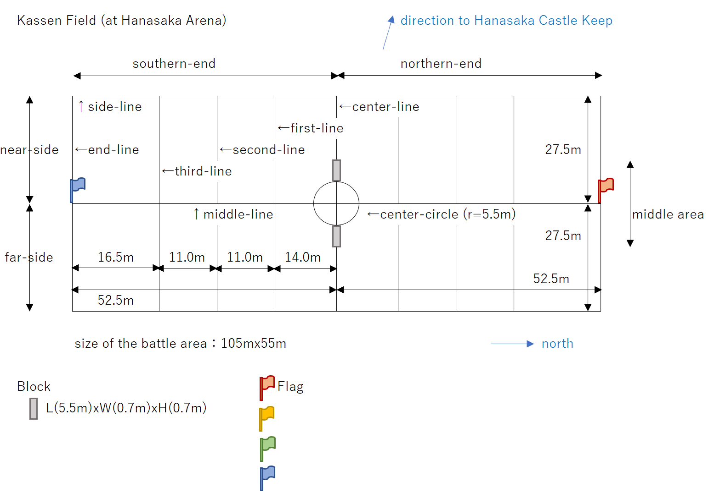

---
aliases:
  - Kassen community
  - Hanasaka Arena
  - battle area
tags:
  - World_Building
  - Core
cssclasses:
---
# **Kassen**

# **Overview** 

**Kassen** is a popular sport developed alongside the establishment of **[Hanasaka City](./HanasakaCity.md)** to provide human-centric, physical entertainment in a society managed by advanced technology. While the sport is themed after the historical warfare associated with **Hanasaka Castle**, it is designed as a modern competition with strict safety rules and primarily uses English terminology. Official matches are held at the **Hanasaka Arena**, a stadium characterized by its white granite structure and movable petal-shaped walls.

The sport is played by **Fighters**, who are citizens aged 20 or older. These athletes belong to one of the four official **Kassen clubs**—"Garnet East", "Topaz South", "Sapphire West", or "Emerald North"—each based in a different administrative district of the city. Furthermore, there are 16 recognized **Alliance clubs** located outside Hanasaka that follow the official regulations and maintain cooperative relationships with the city’s clubs.

The entire **Kassen community**, which includes the clubs, fighters, businesses involved in the manufacturing and related services of Equipment used by the Fighters (such as "workshops"), and fans, is symbolically led by the **Unifier**. The Unifier serves as an icon of integration and a representative of the city's philosophy.

Management and operations are overseen by the **Castle Office** (formally the Hanasaka Castle Development Association), which is responsible for the castle's restoration and match organization. A vital department within this office is the **Equipment Inspection Section (EIS)**. The **EIS** ensures the integrity and safety of the sport by strictly inspecting all **Equipment**—a collective term for the fighters' "Weapons" (such as spears and swords) and "Outfits" (protective armor)—to prevent unauthorized modifications and ensure they meet official specifications.

All rules relating to the Kassen are detailed by the "Kassen Regulations" established by the Castle Office.

---
# **Overview of Kassen Games**

Kassen is a major sport in Hanasaka City, held twice a year as **Season Games** in **Spring** (starting mid-April) and **Autumn** (starting mid-October). These matches take place at the **Hanasaka Arena**, located east of the Hanasaka Castle Outer Moat. Around the time of these season games, **Inter-Alliance Games** (also known as the "Alliance Tour") are held at various castle locations outside the city, where Hanasaka clubs dispatch their Fighters to compete alongside Alliance clubs.

#### **1. Competition Format (Until Spring 9 E.E.)**

Until the Spring Games of 9 E.E., the tournament progressed as follows:

• **Opening Ceremony:** 
The **Opening Ceremony** is held on the field of the Hanasaka Arena on the day of the first match of the Season Games, **prior to the start of the match**. **All Fighters** from the four city clubs (totaling over 200 individuals) are required to assemble on the field to participate. During the ceremony, the **Unifier** formally presides over the event, having issued the official orders for the clubs to assemble, and **declares the start of the Season Games**.

• **Match Rounds:** The four city clubs (Garnet East, Topaz South, Sapphire West, and Emerald North) competed in two round-robin stages: the **first round** and the **second round**.

• **Deciding the Champion:** After both rounds, a **final game** was held between the winner of the first round and the winner of the second round to determine the **champion**. However, if the same team won both rounds, they were crowned champion without a final match.

• **Closing Ceremony and Championship Award:** 
The **Closing Ceremony** is held on the day of the final match of the **Season Games**, immediately after the match concludes. The **Unifier** participates in the ceremony to present the **championship pennant** to the winning club and declares the conclusion of the Season Games. 
While the team champion is honored at this time, the conferral of the **"Apex Fighter"** title takes place separately, typically **two days after** the Season Games have ended, following a detailed performance analysis by the evaluation system.

#### **2. Major Changes from Autumn 9 E.E.**

From the Autumn Games of 9 E.E., the competition was significantly transformed into a struggle for the **"Defense Areas"** of Hanasaka Castle.

• **Claiming Territory:** Instead of just winning a trophy, clubs now competed to obtain rights to guard specific sections of the castle. For each win, a club claimed one of the 12 Defense Areas, starting from the Outer Moat bridges and moving inward to the Outer Defense Zone.

• **Champion Determination:** The reset between rounds was abolished. The champion was now decided by the **total cumulative number of wins** across both the first and second rounds.

• **The Reward:** The champion club earned the prestigious honor of guarding the **Main Keep Area**, formally appointed by the Unifier.

• **Grand Prix:** A new outdoor match against **robots** was introduced to take place in the Outer Defense Zone to determine the **Apex Fighter**, though its implementation was affected by external threats during the 9 E.E. season.

---
# **Progression of a Kassen Match**

A single Kassen match consists of **51 Fighters** per team competing through a series of segments that alternate between team-wide battles and matches between selected representatives.

#### **1. Match Structure**

The match is divided into two halves, with segments progressing in the following order:

• **First-half**: Team Match 1 (T1) → Representative Match 1 (R1) → Team Match 2 (T2)

• **Half-time** (15-minute intermission)

• **Second-half**: Team Match 3 (T3) → Representative Match 2 (R2) → Team Match 4 (T4)

#### **2. Segment Overview**

- **Team Matches (TM)**: All 51 Fighters from both teams clash on the field for **12 minutes**.

- **Representative Matches (RM)**: These are specialized matches held during the 15-minute intermissions between Team Matches.
	- **R1 (Shoot-off)**: Five Bow Fighters from each team take turns shooting at targets to determine a winner.
	- **R2 (Singles Match)**: One high-ranking "Ranked Fighter" from each team competes one-on-one for 5 minutes.

#### **3. Team Matches (TM)**

##### **1) How to Score Points**

- **Pushing the Blocks**:
  Teams score primarily by working together to push a heavy rectangular **"Block"** toward the opponent’s end-line.
	- Pushing a Block past the **first-line**: **1 point**.
	- Pushing it past the **second-line**: **3 points** total.
	- Pushing it past the **third-line**: **6 points** total.

- **Survival Bonus**: 
  If a Team Match ends early because one team has 8 or fewer fighters left, the team with more remaining fighters receives a **2-point bonus**.

##### **2) Tactics of a Team Match**

A **Team Match** is not a simple race to push the Block; it is a tactical battle of attrition. All **51 Fighters** on each team use their **Weapons** (spears, swords, daggers, or arrows) to target the opponent's **Outfits**, specifically the **Torso** and **Arm-guards**.

- **HP Reduction**: 
  Each Fighter begins a match with **20 HP (Hit Points)**, which is electronically stored on a specialized **Nexus Unit** carried in a pocket integrated into their **hip protector**. Points are automatically deducted and overwritten in real-time through a **magnetism-based detection system** whenever an opponent’s magnetized weapon touches the sensors on the **Torso or Arm-guards**. 
  While a standard strike deducts **1 HP**, a hit to the **Front Torso** results in a **Special Deduction (SD) of 5 HP**. Once a Fighter's HP reaches zero, red lights on their Torso flash, signaling that they are incapacitated and must immediately leave the battle area.

- **The Goal**: 
  By reducing the opponent’s active numbers through combat, a team can more effectively cooperate to push the heavy **Block** past the defense lines to score points.

##### **3) Consequences of Taking or Knocking Down the Flag**

In a Kassen match, the team **Flag** is a critical strategic target. The rules regarding the consequences of a Flag being compromised were significantly updated between the Spring and Autumn Games of 9 E.E.

- **Spring Games 9 E.E. and Earlier: Flag Triggered Reset (FTR)**
	- **Action**: **Any Fighter** (including Spear Fighters) pulls the Flag from its stand, or a Bow Fighter knocks it down with an arrow.
	- **Effect**: **Flag Triggered Reset (FTR)**. The match stops, and both Blocks are reset to the center-line.
	- **Strategic Context**: Used mainly as a defensive "reset button" to nullify the opponent's progress when a team was being heavily pushed back.

- **Autumn Games 9 E.E. Onward: Flag Triggered Reset (FTR) + Flag Triggered Advance (FTA)**
	- **Action (By Hand)**: **Any Fighter** (including Spear Fighters) pulls the Flag from its stand.
	- **Effect**: **Flag Triggered Reset (FTR)**. The match stops, and both Blocks are reset to the center-line.
	- **Action (By Arrow)**: Only a **Bow Fighter** knocks down the Flag with an arrow.
	- **Effect**: **Flag Triggered Advance (FTA)**. One Block is advanced **10 meters forward** toward the opponent's end-line.
	- **Strategic Context**: This turned the Flag into an **offensive target**.

#### 4. Representative Matches (RM)

##### **1) R1 (Shoot-off)**

##### **2) R2 (Singles Match)**

##### **3) Winning Representative Matches**

The rewards for winning a **Representative Match (RM)** were updated to maintain match momentum:

- **Spring Games 9 E.E. and Earlier**: Winning an RM allowed the team to **push the opponent’s Block back by one level** (e.g., from the second-line to the first-line). If the opponent had no Block to move back, the winner was simply awarded **1 point**.

- **Autumn Games 9 E.E. Onward**: The rule was changed to ensure that the opponent’s hard-earned Block progress remained untouched. Instead, the winning team always receives **1 point** and gains a **"head-start advantage,"** allowing their fighters to start from the **first-line on the far-side** in the subsequent Team Match.

#### **5. How to Win**

Points are cumulative across all segments. The team with the **highest total score** at the conclusion of Team Match 4 (T4) is declared the winner of the match.

---
# **Hanasaka Arena**

Kassen matches in Hanasaka City will be held at the Hanasaka Arena, owned by the Castle Office.
#### **Overview of Hanasaka Arena**

**Exterior Appearance**: The **Hanasaka Arena** is a magnificent stadium constructed with **white granite**. Its exterior is characterized by four massive, outward-bulging structures known as **"Petals"**. These Petals are movable; they can shift horizontally to follow the sun and provide shade, or extend upward to meet at the center, forming a **dome** to protect the field from rain. A thin film of water constantly flows over the Petals, making them sparkle in the sunlight and glow with various colors at night.

**Internal Layout and the Field**: The center of the arena features a **field** covered in artificial turf. Within this field is the **"battle area,"** a rectangular space measuring **105 meters by 55 meters** where the Fighters engage in Kassen matches.

**Spectator Seating and Capacity**: The arena has a capacity for approximately **5,000 spectators**. The seating stands are situated on the **East, South, and North sides** of the field.

**The Unique West Side Design**: The **West side** (also referred to as the "near-side") is **intentionally left open** without spectator stands. This design allows viewers in the East stands to see the **Hanasaka Castle Keep and its stone walls** as a dramatic backdrop to the matches, which is a major attraction of the venue.

**Operational Facilities on the West Side**: The West side ground and basement levels house the essential operational areas:

- **Ground Level (Semi-Basement):** Located on the West side are the **lounges** (waiting rooms) for both competing clubs, where up to 60 Fighters can rest without being seen by the audience. Situated between these two team lounges is the waiting room for the **EIS (Equipment Inspection Section)**.

- **Basement Level:** Beneath the West side is a highly secure area for **attaching and returning Kassen Equipment**. This facility includes security gates and long conveyor belts used to distribute and collect protective outfits and weapons.

---
# Field and Battle Area

#### **Overview of the Kassen Battle Area**

The **battle area** is a rectangular space located at the center of the Hanasaka Arena's artificial turf field.

• **Dimensions and Orientation**: The area measures **105 meters in length and 55 meters in width**. Its long sides, known as **side-lines**, are drawn along the **north-south direction**. The short edges are called **end-lines**.

• **Field Divisions**:
- **Ends**: The **center-line** (connecting the midpoints of the side-lines) divides the area into the **northern-end** and the **southern-end**.
- **Sides**: The **middle-line** (connecting the midpoints of the end-lines) divides the field into the **near-side** (the western half, closer to Hanasaka Castle) and the **far-side** (the eastern half).

• **Lines and Circles**:
- **Center-circle**: A circle with a **5.5-meter radius** located at the intersection of the center-line and middle-line.
- **Scoring Lines**: Moving from the center-line toward each end-line, there are three parallel lines used for scoring: the **first-line** (14m from center), **second-line** (11m from the first), and **third-line** (11m from the second).

• **Key Placements**:
- **Flag**: The team **Flag** is placed at the **ME-point**, which is the intersection of the middle-line and the end-line.
  The Flag is set into a **"Flag stand,"** which is specifically a **tripod pole stand**. (The exact physical size and weight of the match Flags are not explicitly mentioned in the story.)
  
- **Blocks**: At the start of a match, two **Blocks** are placed on the **center-line**, specifically just outside the edges of the **center-circle**.
  Each **Block** is a rectangular object made of gray polyurethane with a waterproof cover. It measures **5.5m (L) x 0.7m (W) x 0.7m (H)** and weighs **60 kilograms**.

• **The Middle-Area**: This refers to the **band-like region** that runs along the **middle-line** when viewed from the perspective of a team standing with their back to their own Flag.

• **Illustration**: 

---
# Fighters

### **Definition** 

Players belonging to Kassen Club who participate in Kassen matches. To ensure the sport is not an exclusively male-dominated environment, Kassen regulations mandate that teams maintain a **nearly equal balance of male and female players** based on physical characteristics,. This diversity allows Fighters of all genders to excel through cooperation and skill, making the Kassen community a diverse and inclusive group.

### **Eligibility and Citizenship**

To be hired as a Kassen Fighter, an individual must be a **citizenship holder of Hanasaka City** and be **at least 20 years of age**. While the sport is inspired by historical battles, the recruitment process is open to any citizen meeting these criteria, ensuring that no specific ethnic or national origin provides a competitive advantage.

### **Apex Fighter**

The Apex Fighter is the most prestigious title awarded to an individual in the world of Kassen, recognizing the strongest and most exceptional player in the community.
Key details about the title include:

- Selection Process: Unlike team championships decided on the field, the Apex Fighter is chosen through a detailed performance analysis by a combat evaluation system that reviews all matches from the Season Games.
- Historical Holders: For the first nine years of Kassen, the title was held exclusively by two legendary rivals: Don Dandelion (the "King of Flame") and Kagero Sacra (the "Sapphire Shark").
- New Successor: Following the Autumn Games of 9 E.E., Keiko Sacra (the "Sapphire Comet") was officially named the new Apex Fighter after defeating Don Dandelion in a decisive Singles Match.
- Rewards and Honors: While historically a purely symbolic title, starting in 9 E.E., the Apex Fighter receives the "Diamond Sword" and the prestigious duty of serving as the Unifier Kasga’s immediate protector during official ceremonies in the Palace.

### **Battle friends**

In the world of Kassen, the term **"battle friends"** refers to a deep bond of friendship and mutual respect between Fighters belonging to different clubs. This relationship is relatively rare, as it typically develops only after the individuals have faced each other in numerous intense battles.

---
# Fighters taking part in matches

In Kassen matches, each team is composed of a total of **51 Fighters** who compete on the field. 

According to the official regulations, the **50 Fighters (excluding the Captain) who participate in the match** must maintain an **equal ratio of men and women**. This balance is strictly determined based on **physical characteristics**, such as skeletal structure and muscle mass, to ensure competitive fairness in this physically demanding sport.

Their organization and roles are defined by both their rank and the primary weapons they use.

#### **Classification by Roles and Positions**:

Every team features a hierarchy of **15 "Ranked Fighters"** who provide leadership on the field,:

- **Captain (1):** The team’s top commander. Unlike leaders who stay in a waiting room, the Captain **directly participates in the fight within the battle area**, leading the team while engaging in combat. They are also responsible for defending the team Flag.

- **Vice-Captain (2, abbreviated as VC):** Roams the battle area freely to support various squads depending on the situation.

- **Squad Leader (3 or 4, abbreviated as Leader):** Each leads a specific "squad". Beginning in the 9 E.E. Spring Games, teams were permitted to appoint a **fourth Squad Leader** to lead specialized units.

- **Vice-Squad Leader (3 per squad, abbreviated as Vice-Leader or VL):** Assists the Squad Leader in commanding smaller groups of 4–5 Fighters.

#### **Classification by Weapons**

While all Fighters carry a sword and dagger, they are primarily categorized by their specialty:

- **Spear Fighters:** The majority of the team, specializing in close-quarters combat and pushing the heavy Blocks.

- **Bow Fighters (Archers):** Exactly **5 Fighters per team** are designated as Archers. They provide long-range support and are the only Fighters capable of triggering the **Flag Triggered Advance (FTA)** by hitting the opponent's Flag with an arrow.

#### **Mech-horse Eligibility**

A team is limited to using a maximum of **11 mech-horses** simultaneously. Only the following individuals are eligible to ride them:
- The **Captain** and **Vice-Captains**.
- All **Squad Leaders**.
- All **5 Bow Fighters**.

#### **Evolution of Squad Organization and Strategy**

The methodology for deploying squads shifted significantly between the Spring and Autumn Games of 9 E.E. due to rule changes,.

• **Spring 9 E.E. and Earlier (Traditional Layout):** 
Teams typically organized into **three squads of 16 Fighters** (excluding the Captain and Vice-Captains). These squads were positioned in the **left, center, and right** areas of the field relative to their Flag. Each squad was **multi-functional**, containing a mix of Spear and Bow Fighters who performed all tasks (pushing blocks, defending, and attacking) within their assigned zone.

• **Autumn 9 E.E. Onward (Specialized Layout):** 
Rule changes—specifically the introduction of the **Flag Triggered Advance (FTA)**—incentivized teams to consolidate Bow Fighters into offensive units. Teams shifted toward **functional specialization**, dividing into four distinct squad types:

- **FAS (Flag Attacker Squad):** Usually **a mixed unit of Bow Fighters and Spear Fighters** tasked with penetrating enemy lines to strike the Flag.

- **FDS (Flag Defender Squad):** Defensive units stationed near the team’s own Flag to intercept enemy FAS.

 - **BPS (Block Pusher Squad):** Units deployed on the **near-side** and **far-side** specifically to focus on the physical task of pushing the Blocks toward the scoring lines.

---
# Umpires

In Kassen, **human umpires do not exist** because the people of Hanasaka believe humans are incapable of making perfectly accurate judgments. Instead, the matches are officiated by specialized robots:

• **Mech-giraffes:** Four of these robots are positioned outside the side-lines, each overseeing one of the field's four quadrants. Standing approximately 3 meters tall, they monitor for fouls and communicate with Fighters using speech functions.

• **Mech-dragonflies:** Sixteen small flying robots hover about 5 meters above the battle area, monitoring the Fighters' actions from an aerial perspective to provide complete coverage.

**How they officiating:** When a foul is detected or an injury occurs, the umpire emits a **whistle sound** and wirelessly sends a signal that **deactivates all Equipment** on the field, bringing the match to an immediate halt. The umpire then identifies the offender, who must leave the battle area and return to their end-line to have **5 HP deducted** by an EIS inspector.

### **Prohibited Actions (Fouls)**:
Fighters must adhere to strict rules of conduct. The following behaviors are considered fouls:

• **Physical Strikes:** Kicking or ramming an opponent (or their mech-horse), punching with fists, and striking with the head or elbows.

• **Grappling:** Strangling, bear-hugging, or using techniques from martial arts like Judo or Wrestling.

• **Illegal Attacks:** Intentionally attacking the neck, head, or groin area with weapons.

• **Dismounting Violations:** Forcing someone off their mech-horse (though a rider may use their horse's controls to shake off an opponent who has jumped onto it).

• **Boundary Violations:** Advancing while outside the side-lines or attacking from outside the battle area.

• **Unsportsmanlike Conduct:** Deliberately passive play or stalling for time.

---
# Equipment

### **Definition:** 
The collective term for the gear used by **Kassen Fighters** during games to attack opponents or protect themselves, encompassing both non-lethal **Weapons**, which are handheld offensive tools, and **Outfits**, which are worn on the body for protection.

### **1. Weapons**

All Kassen weapons are designed to be non-lethal, using materials such as special rubber instead of metal. Every Fighter is required to carry a **Sword** and a **Dagger** at their waist as standard gear.

- **Spear**: 
  A long-range weapon measuring **2 meters 20 centimeters** in total length. The blade is made of special rubber with a rounded tip (spear-head) to prevent injury. A Fighter who fights with this weapon is called a **“Spear Fighter”**.

- **Sword**: 
  A basic weapon with a rubber blade.

- **Dagger**: 
  A short-range weapon with a blade length of **25 centimeters**. It is used for close-quarters combat but is generally less advantageous than a sword or spear.

- **Bow**: 
  A short bow measuring **just over 1 meter** in length, chosen for its maneuverability over traditional longbows. A Fighter who fights with this is called a **“Bow Fighter”** or **“Archer”**.

- **Arrow**: 
  The arrow-head is a **2-centimeter diameter sphere** made of lightweight rubber.

- **Quiver**: 
  A container worn on the waist or hip that stores up to **10 arrows**.

### **2. Outfits**

The protective gear consists of seven main parts, primarily made of reinforced plastic to ensure safety and functionality.

- **Helmet**: 
  A reinforced plastic head-guard. **"Ranked Fighters"** (those with a title of Vice-Leader or higher) are permitted to attach a decorative **"Crest"** to the front of their helmet.

- **Torso protector (Torso)**: 
  A reinforced plastic protector consisting of front and back plates connected at the waist with hook-and-loop fasteners (Velcro). The **"Front Torso"** is a primary target for scoring (Hit Point deduction) in matches.

- **Shoulder protector**: 
  Protects the body from the **shoulder to the area above the elbow**.

- **Forearm guard (Arm-guard)**: 
  Protects the arm from the elbow to the back of the hand and includes elbow pads. Hits to this area also result in Hit Point deductions.

- **Skirt**: 
  Protects the body from the **waist down to the thighs**. It is **suspended from the bottom of the Torso**.

- **Hip protector**: 
  Worn underneath the skirt. It features a pocket for the **Nexus Unit**, which records and tracks the Fighter's **Hit Points (HP)** during a match.

- **Shin protector**: 
  Protects the legs from the knee down and includes knee pads.

---
# Workshops

In the world of Kassen, **Equipment workshops** (often simply referred to as **"workshops"**) are specialized businesses that manufacture, decorate, and repair the equipment used by Fighters.

**Core Functions and Roles**

• **Customization:** While basic Kassen equipment is mass-produced by certified manufacturers according to strict standards, Fighters are allowed a degree of freedom regarding surface decorations. Workshops customize these items to help Fighters appeal to fans or improve usability.

• **Maintenance and Repair:** Workshops handle the repair of damaged gear. For example, **Workshop Nemophila** repaired Keiko Sacra’s "Four Star Spear" after it was damaged in a match.

• **Safety Compliance:** All Kassen weapons (spears, swords, daggers, bows, and arrows) must be non-lethal, utilizing materials like special rubber for blades. Workshops must ensure all customizations adhere to the official standards set by the **Castle Office**.

**Regulation and Oversight**

The **Equipment Inspection Section (EIS)** of the Castle Office regularly monitors these workshops through "Regular Diagnosis" and "On-site Inspections". This oversight ensures that workshops do not perform illegal modifications or create lethal versions of Kassen weapons that could jeopardize the sport's safety.

**Key Example: Workshop Nemophila**

A prominent example in the sources is **Workshop Nemophila**, located in the Pegasus district and managed by **Kagero Sacra**. It is famous for creating the "Four Star Spear," which features four illuminated imitation sapphires. Notably, with special permission from the Police Department, some workshops are also capable of manufacturing real, lethal swords for ceremonial or high-security purposes.

- **Management and Staff**
	• **Owner/President:** **Kagero Sacra**, Keiko's elder brother, a former prominent Kassen Fighter known as "Sapphire Shark".
	• **Vice President:** **Sawae Nemophila**, Kagero’s wife.

---
# **Kassen Club(s)**

## **Definition:** 
Fighters who compete in Kassen matches belong to one of the **four Kassen clubs** in Hanasaka City: **Garnet East, Topaz South, Sapphire West, and Emerald North**. Additionally, there are **16 Alliance clubs** located in the neighboring country of "**Moto**". These clubs maintain agreements with the Hanasaka teams, facilitating fighter dispatches and matches held outside the city.

## **Kassen Clubs in Hanasaka City**:

### **1. Garnet East**
- **Home Base:** East District
- **Club Manager:** Rudra
- **Club Color:** Red (Garnet Red)
- **Warrior Image:** "Fighter of the Scorching Sun"
- **Captain:** Don (Don Dandelion)

### **2. Topaz South**
- **Home Base:** South District / Verbena
- **Club Manager:** Crista
- **Club Color:** Yellow (Topaz Yellow)
- **Warrior Image:** "Fighter of the Earth"
- **Captain:** Unknown (Note: Emilio and Abilio are Vice-Captains)

### **3. Sapphire West**
- **Home Base:** West District / Victoria (Victoria Sports Center)
- **Club Manager:** Aila
- **Club Color:** Blue (Sapphire Blue)
- **Warrior Image:** "Fighter of the Sea"
- **Captain:** Soa

### **4. Emerald North**
- **Home Base:** North District
- **Club Manager:** Alces
- **Club Color:** Green (Emerald Green)
- **Warrior Image:** "Fighter of the Forest"
- **Captain:** Nitai

## **Alliance Clubs (Outside Hanasaka)**

**1. Himeji Egrets**
- **Home Base:** Himeji Castle
- **Club Manager:** Nakagawa

**2. Hikone Cats**
- **Home Base:** Hikone Castle
- **Club Manager:** Unknown

**3. Maruoka Lilies**
- **Home Base:** Maruoka Castle
- **Club Manager:** Unknown
- Note: Fighter Keiko had been a member of this club for two years after graduating from high school.

**4. Odawara Triangles**
- **Home Base:** Odawara Castle
-  **Club Manager:** Ise

**5. Aizu Red-cattle**
- **Home Base:** Aizu-Wakamatsu Castle
- **Club Manager:** Unknown

**6. Wakayama Oceans**
- **Home Base:** Wakayama Castle
- **Club Manager:** Unknown

**7. Matsumoto Alliance Club (Name Unknown)**
- **Home Base:** Matsumoto Castle
- **Club Manager:** Unknown

**8. Marugame Alliance Club (Name Unknown)**
- **Home Base:** Marugame Castle
- **Club Manager:** Unknown

## **The Honored Eight:

On November 9th, 9 E.E. during the anticipated raid by the "Hanasaka Citizens' Liberation Front," eight select Fighters were appointed as **1st-class security guards** under the Castle Guardians Association. Known as **"The Honored Eight,"** they were tasked with defending the Rose Gate and providing the primary rescue force for Kasga in the event of an emergency.

The members from each club are as follows:
- **Garnet East:** **Don** (Captain) and **Einan** (Vice-Captain).
- **Topaz South:** **Emilio** (Vice-Captain) and **Nelio** (Leader).
- **Sapphire West:** **Keiko** (Leader) and **Falcon** (Vice-Leader).
- **Emerald North:** **Chammei** (Leader) and **Apti** (Vice-Captain).

---
# Code of Conduct

The Kassen community maintains strict codes of conduct to ensure the fairness, safety, and integrity of the sport.

### 1. Restrictions on EIS Personnel and Fighters

- Prohibition of Private Interaction: Members of the Equipment Inspection Section (EIS) are strictly forbidden from having private or personal relationships with Kassen Fighters, club staff, or equipment-related businesses.
- Ensuring Impartiality: This rule is designed to prevent collusion or unauthorized equipment modifications that could compromise competitive fairness or the safety of the non-lethal weapons used.
- Public Conduct: EIS members must avoid even the appearance of a close relationship, such as speaking familiarly in public, to maintain their status as impartial inspectors.

### 2. Reporting of Expensive Gifts

- The 1,000 XC Threshold: Kassen Fighters are required to report to their clubs any money, goods, or services received for free (or at a significantly low price) that are valued at 1,000 XC or more.
- Exemptions: This reporting obligation applies to gifts from anyone other than the Fighter's immediate family or relatives.
- Purpose: This rule reinforces the philosophy that "Fighters serve all citizens" and is intended to prevent Fighters from being exploited or influenced by specific organizations, wealthy individuals, or anti-social forces.

---
# Unifier

### **Definition:** 
Formally known as the "Unifier of the Kassen Community," this figure stands transcendentally above the **Castle Office** and all **Kassen clubs** both within and outside the city, serving as a "symbol of unity" within the **Kassen community**. Entrusted by the Castle Office, she does not possess any strong authority but rather serves as a figurehead to brightly promote and enliven Kassen.

### Tenure:
- the First: Haruna Laliguras (January 2, 1 E.E. - November 30, 5 E.E.)
- the Second: Kasga Wisteria, (December 1, 5 E.E. - )

